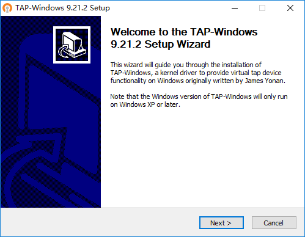
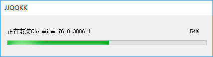
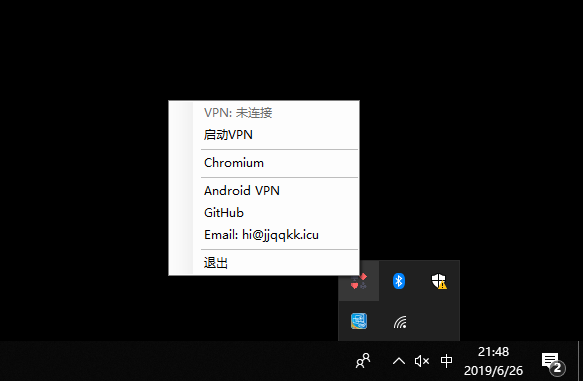
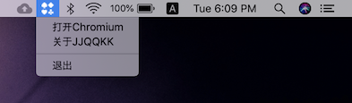

[English](README_en.md)

# JJQQKK上网助手

JJQQKK提供Windows和macOS版本的VPN和内置代理服务的Chromium浏览器。

用户可以任选一种方式科学上网：

* 启动VPN，加密所有网络活动（推荐）
* 通过Chromium浏览器访问所有网站

JJQQKK支持32/64位Windows 7/8/10，10.12以上版本的macOS。

## 下载JJQQKK

### Windows安装包

[下载地址一](http://206.189.78.230/JJQQKK-2.1.0.msi)

[下载地址二](https://github.com/jjqqkk/chromium/releases/download/76.0.3809.12/JJQQKK-2.1.0.msi)

运行msi安装程序，安装之后双击桌面图标，启动程序。

首次使用，请务必安装OpenVPN驱动。每个步骤都采用默认设置即可。

JJQQKK每次启动时会自动下载最新版Chromium浏览器。

通过桌面任务栏图标操作JJQQKK。

有两种上网方式可供选择，推荐使用VPN。启动VPN之后，电脑上所有网络活动都被加密。

如果仅需浏览网页，或者VPN暂时无法连接时，用内置代理服务的Chromium浏览器。

### macOS安装包

[下载地址一](http://206.189.78.230/JJQQKK-2.1.0.pkg)

[下载地址二](https://github.com/jjqqkk/chromium/releases/download/76.0.3809.12/JJQQKK-2.1.0.pkg)

macOS用户安装pkg之后，系统自动运行JJQQKK，通过顶端任务栏图标使用JJQQKK。

## 关于Chromium浏览器

Chromium是Google為發展自家的瀏覽器Google Chrome而開啟的計畫，以BSD授權條款等數種授權發行並開放原始碼。Chromium与Google Chrome共享大部分程式碼和功能，但功能和商標之間有一些細微差別。

Chromium的更新速度很快，每隔數小時即有新的開發版本發佈，每次的更新幅度不一定相同，可能增加新功能，或者單純修正問題，由於新功能會先在Chromium上測試，等待認證後才會應用在Google Chrome上，所以Chromium相當於Google Chrome的先行版。

如需手工下载Chromium，请从[Releases页面](https://github.com/jjqqkk/chromium/releases)下载最新版本。旧版本可能无法正常使用科学上网。

## 常见问题

**无法安装插件**

由于内置的代理组件无法完美兼容Chrome Extension，这款浏览器屏蔽了插件系统，以防止安装插件之后彻底毁坏代理能力。未来会有其他解决方案。

**无法登录Google和使用同步功能**

出于安全考虑，Chromium没有配置Google API，所以无法像Chrome一样登录浏览器。打开浏览器时会提示"missing API key"。

**是否提供64位Windows版本**

Windows版本Chromium默认使用32位编译，完美支持所有32位和64位系统，不存在兼容性问题。32位浏览器运行文件更小。所以如果没有功能方面的明显差异，只提供32位Windows浏览器。

## 避免失联

电邮：jjjqqqkkk@gmx.com

可通过电邮获得最新软件下载地址。

## 拍照分享

