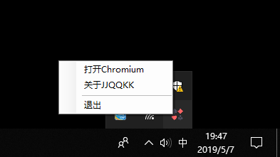
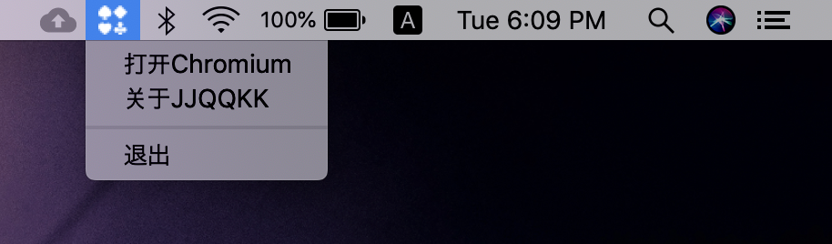

# 直接科学上网的Chromium浏览器

Chromium浏览器直接从Google源代码编译，保持原汁原味的Chrome使用体验，同时启用了浏览器内置的代理组件，让用户不需要安装任何第三方软件，直接
通过浏览器访问全球站点。

Chromium是Google為發展自家的瀏覽器Google Chrome而開啟的計畫，以BSD授權條款等數種授權發行並開放原始碼。Chromium与Google Chrome共享大部分程式碼和功能，但功能和商標之間有一些細微差別。

Chromium的更新速度很快，每隔數小時即有新的開發版本發佈，每次的更新幅度不一定相同，可能增加新功能，或者單純修正問題，由於新功能會先在Chromium上測試，等待認證後才會應用在Google Chrome上，所以Chromium相當於Google Chrome的先行版。

## 获取Chromium

### 通过JJQQKK安装器下载Chromium

JJQQKK安装器能加速下载最新版Chromium，推荐所有用户使用JJQQKK安装器。支持Windows和macOS。

[Windows安装包](https://github.com/jjqqkk/chromium/releases/download/75.0.3770.15/JJQQKK-1.0.0.msi)

[macOS安装包](https://github.com/jjqqkk/chromium/releases/download/75.0.3770.15/JJQQKK-1.0.0.pkg)

### 使用方法

Windows用户下载msi安装包，安装之后双击图标启动JJQQKK，随后通过任务栏小图标打开浏览器。

macOS用户下载pkg安装包，按住Command键，点击pkg文件，从菜单里选择打开，完成安装。安装之后，从屏幕顶端的任务栏使用JJQQKK。

### 手工下载

从[Release页面](https://github.com/jjqqkk/chromium/releases)手工下载浏览器zip压缩包，解压缩之后可以直接使用。

Windows用户，从解压缩之后的目录里找到**chromium.exe**，双击启动。

macOS用户，解压缩之后直接得到Chromium.app，双击启动。

手工安装的浏览器无法自动更新。推荐使用JJQQKK安装器管理Chromium。

## 常见问题

**无法安装插件**

由于内置的代理组件无法完美兼容Chrome Extension，这款浏览器屏蔽了插件系统，以防止安装插件之后彻底毁坏代理能力。未来会有其他解决方案。

**无法登录Google和使用同步功能**

出于安全考虑，Chromium没有配置Google API，所以无法像Chrome一样登录浏览器。打开浏览器时会提示"missing API key"。

**64位Windows**

Windows版本Chromium默认使用32位编译，完美支持所有32位和64位系统，不存在兼容性问题。而且32位浏览器运行文件更小。所以如果没有功能方面的差异，只提供32位Windows浏览器。

**代理服务是免费的吗**

目前是完全免费，不需要注册账号，不需要签到，可以一直使用。

